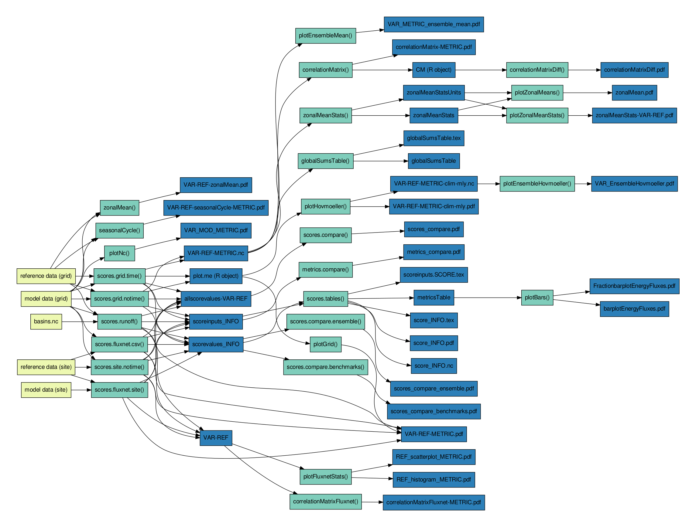

```{r, include = FALSE}
knitr::opts_chunk$set(
  collapse = TRUE,
  comment = "#>"
)
```

```{r setup}
library(amber)
```
## Context
The Canadian Land Surface Scheme Including Biogeochemical Cycles (CLASSIC) is the land surface component of the Canadian Earth System Model (CanESM) [@Melton2020-ke]. CLASSIC is a process-based ecosystem and land surface model designed for use at scales ranging from site-level to global. Environment and Climate Change Canada develops and maintains CLASSIC as an open-source community model. CLASSIC is the successor to its two component models: CLASS and CTEM.

The Automated Model Benchmarking R package (AMBER) evaluates the ability of CLASSIC to reproduce land surface processes by comparing model outputs against observation-based gridded products, such as satellite imagery, and in situ observations such as eddy covariance flux tower measurements or stream flow records. To summarize model performance across different statistical metrics AMBER employs a skill score system that was originally developed by the International Land Model Benchmarking (ILAMB) framework [@Collier2018-th]. AMBER was created to tailor the ILAMB skill score approach for CLASSIC model outputs. While AMBER was tested for CLASSIC only it may also work for other models. Figures produced with AMBER can be accessed [here](https://cseiler.shinyapps.io/ShinyAmber/).

## Functions
The functions provided by AMBER can be grouped into three categories:

  * Functions that compute skill scores and other metrics for a single variable. This includes: *scores.fluxnet.csv*, *scores.fluxnet.nc*, *scores.fluxnet.site*, *scores.functional.response*, *scores.grid.notime*, *scores.grid.time*, *scores.runoff*, and*scores.site.notime*.

  * Functions that visualize model output for a single variable. This includes the functions *plotEnsembleHovmoeller*, *plotEnsembleMean*, *plotGrid*, *plotHovmoeller*, *plotNcIrreg*, *plotNc*, *plotZonalMeans*, *plotZonalMeanStats*, *seasonalCycleIrreg*, *seasonalCycle*, *zonalMeanIrreg*, *zonalMean*, and *zonalMeanStats*. The suffix *Irreg* indicates that this function may be applied to data that is on an irregular grid.

  * Functions that visualize summary statistics across multiple variables. This includes: *scores.compare.benchmarks*, *scores.compare.ensemble*, *scores.compare*, *scores.tables*, *scores.tables.tweak*, *correlationMatrixDiff*, *correlationMatrixFluxnet*, *correlationMatrix*, *globalSumsTable*, *metrics.compare*, *plotBars*, and, *plotFluxnetStats*. The string *ensemble* implies that the function is designed to handle multiple model runs.

## Scores
The performance of a model is expressed through scores that range from
zero to one, where increasing values imply better performance. These
scores are computed for each variable in five steps: ($i$) computation
of a statistical metric, ($ii$) nondimensionalization, ($iii$)
conversion to unit interval, ($iv$) spatial integration, and ($v$)
averaging scores computed from different statistical metrics. The latter
includes the bias, root-mean-square error, phase shift, inter-annual
variability, and spatial distribution. The computation of a scalar score
is exemplified for the bias below. The bias is defined as follows:

$$bias(\lambda, \phi)=\overline{v_{mod}}(\lambda, \phi)-\overline{v_{ref}}(\lambda, \phi),$$

where $\overline{v_{mod}}(\lambda, \phi)$ and
$\overline{v_{ref}}(\lambda, \phi)$ are the mean values in time ($t$) of
a variable $v$ as a function of longitude $\lambda$ and latitude $\phi$
for model and reference data, respectively. Nondimensionalization is
achieved by dividing the bias by the standard deviation of the reference
data ($\sigma_{ref}$):

$$\label{epsilon_bias}
\varepsilon_{bias}(\lambda, \phi)=|bias(\lambda, \phi)|/\sigma_{ref}(\lambda, \phi)$$.

A bias score that ranges between zero and one is
calculated next:

$$s_{bias}(\lambda, \phi)=e^{-\varepsilon_{bias}(\lambda, \phi)}.$$

The spatial integration of $s_{bias}$ leads to the scalar score:
$$S_{bias}=\overline{\overline{s_{bias}}}(\lambda, \phi).$$

Similar approaches are used for obtaining spatially integrated score
values for the root-mean-square error ($S_{rmse}$), phase shift
($S_{phase}$), inter-annual variability ($S_{iav}$), and spatial
distribution ($S_{dist}$) (Table 1). These score
values are then combined to derive a single overall score for each
output variable:

$$S_{overall}=\frac{S_{bias}+2S_{rmse}+S_{phase}+S_{iav}+S_{dist}}{1+2+1+1+1}.$$

Note that $S_{rmse}$ is weighted by a factor of two, which emphasizes
its importance. Values of $S_{overall}$ can be combined across different
variables to obtain a complete score across all variables for a given
model.

The spatial integration can be weighted, where regions with large values
of $\overline{v_{ref}}(\lambda, \phi)$ become more important. This is
useful when the nondimensionalization leads to large relative errors,
and hence a poor score.

  Score       Step   Equation
  ----------  ----- ------------------------------------------------------------
              (1)    $bias(\lambda, \phi)=\overline{v_{mod}}(\lambda, \phi)-\overline{v_{ref}}(\lambda, \phi)$
              (2)    $\varepsilon_{bias}=|bias(\lambda, \phi)|/\sigma_{ref}(\lambda, \phi)$, where $\sigma_{ref}$ is the standard deviation of the reference data
              (3)    $s_{bias}(\lambda, \phi)=e^{-\varepsilon_{bias}(\lambda, \phi)}$
  $S_{bias}$  (4)    $S_{bias}=\overline{\overline{s_{bias}}}$
              (1)    $rmse(\lambda, \phi)=\sqrt{\frac{1}{t_{f}-t_{0}}\int_{t_{0}}^{t_{f}}(v_{mod}(t,\lambda, \phi)-v_{ref}(t,\lambda, \phi))^{2}dt}$
              (2)    $\varepsilon_{rmse}(\lambda, \phi)=crmse(\lambda, \phi)/\sigma_{ref}(\lambda, \phi)$, where $crmse(\lambda, \phi)$ $=\sqrt{\frac{1}{t_{f}-t_{0}}\int_{t_{0}}^{t_{f}}[(v_{mod}(t,\lambda, \phi)-\overline{v_{mod}}(\lambda, \phi))-(v_{ref}(t,\lambda, \phi)-\overline{v_{ref}}(\lambda, \phi))]^{2}dt}$
              (3)    $s_{rmse}(\lambda, \phi)=e^{-\varepsilon_{rmse}(\lambda, \phi)}$
  $S_{rmse}$  (4)    $S_{rmse}=\overline{\overline{s_{rmse}}}$
              (1)    $\theta(\lambda, \phi)=\max(c_{mod}(t,\lambda, \phi))-\max(c_{ref}(t,\lambda, \phi))$
              (2)    not applicable, as units are consistent across all variables
              (3)    $s_{phase}(\lambda, \phi)=\frac{1}{2}[1+\cos(\frac{2\pi\theta(\lambda, \phi)}{365})]$
  $S_{phase}$ (4)    $S_{phase}=\overline{\overline{s_{phase}}}$
              (1)    $iav_{ref}(\lambda, \phi)=\sqrt{\frac{1}{t_{f}-t_{0}}\int_{t_{0}}^{t_{f}}(v_{ref}(t,\lambda, \phi)-c_{ref}(t,\lambda, \phi))^{2}dt}$, $iav_{mod}(\lambda, \phi)=\sqrt{\frac{1}{t_{f}-t_{0}}\int_{t_{0}}^{t_{f}}(v_{mod}(t,\lambda, \phi)-c_{mod}(t,\lambda, \phi))^{2}dt}$
              (2)    $\varepsilon_{iav}=|(iav_{mod}(\lambda, \phi)-iav_{ref}(\lambda, \phi))|/iav_{ref}(\lambda, \phi)$
              (3)    $s_{iav}(\lambda, \phi)=e^{-\varepsilon_{iav}(\lambda, \phi)}$
  $S_{iav}$   (4)    $S_{iav}=\overline{\overline{s_{iav}}}$
              (1)    $\sigma=\sigma_{\overline{v_{mod}}}/\sigma_{\overline{v_{ref}}}$
              (2)    not applicable
              (3)    not applicable
  $S_{dist}$  (4)    $S_{dist}=2(1+R)/(\sigma+\frac{1}{\sigma})^{2}$, where $R$ is the spatial correlation coefficient of $\overline{v_{ref}}(\lambda, \phi)$ and $\overline{v_{mod}}(\lambda, \phi)$

  Table: **Table 1** Equations used for computing spatially integrated scalar scores for each
variable. The four steps refer to (1) the definition of the statistical
metric, (2) nondimensionalization, (3) conversion to unit interval, and
(4) spatial integration. The integration limits $t_{0}$ and $t_{f}$ are
the initial and final time step, respectively. The variables $c_{mod}$
and $c_{ref}$ refer to the monthly mean annual cycle of the model and
reference data, respectively.

## Examples
### Comparing model results against gridded reference data
```{r, eval = FALSE}
library(amber)
library(doParallel)
library(ncdf4)
library(raster)

long.name <- 'Gross primary productivity'
nc.mod <- system.file('extdata/modelRegular', 'gpp_monthly.nc', package = 'amber')
nc.ref <- system.file('extdata/referenceRegular', 'gpp_GBAF_128x64.nc', package = 'amber')
mod.id <- 'CLASSIC' # define a model experiment ID
ref.id <- 'GBAF' # give reference dataset a name
unit.conv.mod <- 86400*1000 # optional unit conversion for model data
unit.conv.ref <- 86400*1000 # optional unit conversion for reference data
variable.unit <- 'gC m$^{-2}$ day$^{-1}$' # unit after conversion (LaTeX notation)

plot.me <- scores.grid.time(long.name, nc.mod, nc.ref, mod.id, ref.id, unit.conv.mod,
unit.conv.ref, variable.unit)
# Create a plot in PDF format
plotGrid(long.name, plot.me)
```

### Comparing model results against eddy covariance flux tower measurements
```{r, eval = FALSE}
library(amber)
library(doParallel)
library(ncdf4)
library(raster)

long.name <- 'Gross primary productivity'
nc.mod <- system.file('extdata/modelRegular', 'gpp_monthly.nc', package = 'amber')
ref.csv <- system.file('extdata/referenceRegular', 'gpp_monthly_fluxnet.csv', package = 'amber')
mod.id <- 'CLASSIC' # define a model experiment ID
ref.id <- 'FLUXNET' # give reference dataset a name
unit.conv.mod <- 86400*1000 # optional unit conversion for model data
unit.conv.ref <- 1 # optional unit conversion for reference data
variable.unit <- 'gC m$^{-2}$ day$^{-1}$' # unit after conversion (LaTeX notation)

scores.fluxnet.csv(long.name, nc.mod, ref.csv, mod.id, ref.id,
unit.conv.mod, unit.conv.ref, variable.unit)
```

### Comparing model results against streamflow measurements
```{r, eval = FALSE}
library(amber)
library(doParallel)
library(ncdf4)
library(raster)
library(latex2exp)

long.name <- 'Streamflow'
nc.mod <- system.file('extdata/modelRegular', 'mrro_monthly.nc', package = 'amber')
nc.ref <- system.file('extdata/referenceRegular', 'runoff.nc', package = 'amber')
nc.basins <- system.file('extdata/referenceRegular', 'basins.nc', package = 'amber')
mod.id <- 'CLASSIC' # model name
ref.id <- 'GRDC' # give reference dataset a name
unit.conv.mod <- 86400 # optional unit conversion for model data
unit.conv.ref <- 86400 # optional unit conversion for reference data
variable.unit <- 'kg m$^{-2}$ day$^{-1}$' # unit after conversion (LaTeX notation)
score.weights <- c(1,2,1,1,1) # define score weights

scores.runoff(long.name, nc.mod, nc.ref, nc.basins, mod.id, ref.id, unit.conv.mod,
unit.conv.ref, variable.unit, score.weights)
```
## Relations between inputs, functions, and outputs
The Figure below visualizes the relations between AMBER inputs (yellow boxes), functions (green boxes), and outputs (blue boxes). This figure may guide the user for running the different functions in concert.


## Acknowledgements
The example data provided with this package includes eddy covariance data acquired and that is shared by the FLUXNET community, including these networks: AmeriFlux, AfriFlux, AsiaFlux, CarboAfrica, CarboEuropeIP, CarboItaly, CarboMont, ChinaFlux, Fluxnet-Canada, GreenGrass, ICOS, KoFlux, LBA, NECC, OzFlux-TERN, TCOS-Siberia, and USCCC. The ERA-Interim reanalysis data are provided by ECMWF and processed by LSCE. The FLUXNET eddy covariance data processing and harmonization was carried out by the European Fluxes Database Cluster, AmeriFlux Management Project, and Fluxdata project of FLUXNET, with the support of CDIAC and ICOS Ecosystem Thematic Center, and the OzFlux, ChinaFlux and AsiaFlux offices. Other example data have been provided by the International Land Model Benchmarking (ILAMB) project.

## References
